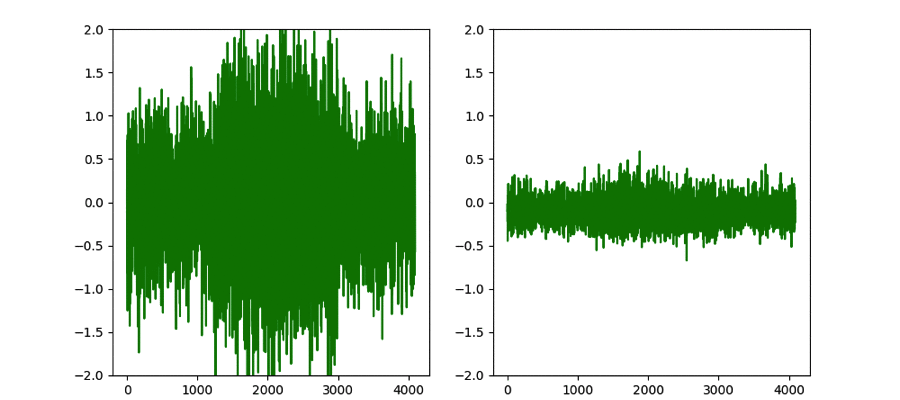

# Convolutional Denoising Autoencoder

Convolutional denoising autoencoders are essentially ...just that! What's nice is seeing them work on learning how to denoise a simple sinusoidal pulse, in a completely unsupervised fashion. While the above is simple, it did help illustrate that frequencies outside the training set were not generalizable to, whereas arbitrary pulse lenghts were. (The above animation shows it learning on a validation sample). 

More to follow on where signal processing meets machine learning! 

To run, simply type:  `python denoising_autoencoder.py -g 0` for no GPU support, or `python denoising_autoencoder.py -g 1` for GPU support.
